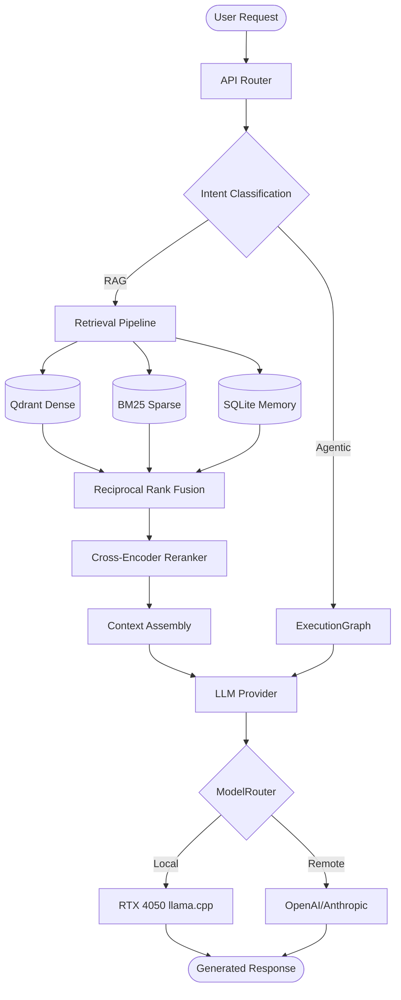

# Syntera System Architecture

## 1. Overview
Syntera operates as a highly modular, graph-based AI engine. The core philosophy separates **orchestration** (`ExecutionGraph`) from **intelligence** (`IntelligenceCore` / Providers) and **context** (`Retrieval` / `Memory`).

## 2. Component Architecture

### 2.1 API & Backend (`backend/api/`)
The primary entry point. 
- **`router.py`**: Intercepts requests, classifying them into `DIRECT`, `RAG`, `MULTI_MODAL`, or `AGENTIC` paths.
- **Responsibility**: Expose HTTP endpoints, route payloads to the correct internal subsystem, and return standardized JSON responses.

### 2.2 ExecutionGraph (`backend/core/graph/`)
The absolute foundation for all multi-step processes.
- **Responsibility**: Execute directed acyclic graphs (DAGs) of tasks (`nodes`). 
- **Features**: Supports concurrent execution (`ThreadPoolExecutor`), failure policies (`FAIL_FAST`, `SKIP_DEPENDENTS`), and isolated state management (`GraphState`).
- **Durability (`backend/core/durability/`)**: Injects a `DurableStore` (SQLite) into the graph to checkpoint state at batch boundaries, enabling crash-resilient `resume()` capabilities.

### 2.3 Modular RAG & Retrieval (`backend/retrieval/`)
- **Ingestion & Chunking**: Uses `BaseChunker` abstractions (Fixed, Semantic, Structure-Aware) to parse documents (e.g., preserving Markdown hierarchy).
- **Retrieval Pipeline**: 
  - Dense Search (Qdrant + embeddings).
  - Sparse Search (BM25).
  - Merged via Reciprocal Rank Fusion (RRF).
  - Reranked via Cross-Encoders (TinyBERT).
- **Context Assembly**: Constructs prompt-ready context blocks with verifiable source citations.

### 2.4 Memory (`backend/memory/`)
A structured subsystem (`Working`, `Episodic`, `Semantic`, `LongTerm`) managed by a SQLite store.
- **Integration**: Plugs directly into the Modular RAG system via `MemoryRetriever`, treating memory as just another vector/sparse source for seamless context injection.

### 2.5 Intelligence & Providers (`backend/providers/`)
Abstracts external dependencies.
- **Providers**: `llm.py` and `embeddings.py` expose standard contracts.
- **Local NVIDIA Inference (Phase 12 MVP)**: Currently operating in an isolated `.syntera-nvidia` Python 3.11 environment utilizing CUDA-accelerated `llama.cpp` for local RTX 4050 execution.
- **ModelRouter (Planned)**: Will dynamically route requests between remote APIs and local VRAM-bound models based on cost, context size, and privacy constraints.

### 2.6 Agentic Orchestration (`backend/orchestration/agentic/`)
- Builds on top of `ExecutionGraph`. 
- **State**: Manages `AgentState`.
- **Tools**: Abstracts callable functions for LLMs.
- **Multi-Agent / Swarm (Planned)**: Will allow independent agents to collaborate by sharing sub-graphs and memory spaces.

### 2.7 AI Creation & Evolution (`backend/core/creation/`)
- **AISystemBuilder**: Programmatic factory for assembling RAG/Agent instances.
- **Evolution Engine (Planned)**: Will iteratively test and modify prompts, models, and graph structures against an evaluation baseline.

## 3. Data & Execution Flow

*(Note: `ModelRouter` integration with the `CUDA` backend is currently in progress).*
